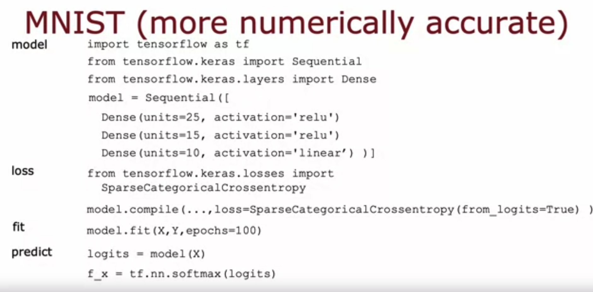

**1.**

**For a multiclass classification task that has 4 possible outputs, the sum of all the activations adds up to 1. For a multiclass classification task that has 3 possible outputs, the sum of all the activations should add up to ….**

- [ ] It will vary, depending on the input x.
- [x] 1
- [ ] More than 1
- [ ] Less than 1

Note: Yes! The sum of all the softmax activations should add up to 1. One way to see this is that if $e^{z1}=10,e^{z2}=20,e^{z3}=30$ then the sum of $a1 + a2 + a3$ is equal to $e^{z1} + e^{z2} + e^{z3}$ which is 1.

**2. For multiclass classification, the cross entropy loss is used for training the model. If there are 4 possible classes for the output, and for a particular training example, the true class of the example is class 3 (y=3), then what does the cross entropy loss simplify to? [Hint: This loss should get smaller when a3a3​ gets larger.]**

- $\frac{-\log{a_1}+-log(a_2)+-log(a_3)+-log(a_4)}{4}$
- $z_3$
- $\log(a_3)$
- $\frac{z_3}{z_1 + z_2 + z_3 + z_4}$

Note: Correct. When the true label is 3, then the cross entropy loss for that training example is just the negative of the log of the activation for the third neuron of the softmax. All other terms of the cross entropy loss equation $(−\log(a_1),−\log(a_2),and−\log(a_4))$ are ignored

**3. For multiclass classification, the recommended way to implement softmax regression is to set from_logits=True in the loss function, and also to define the model's output layer with…**

- [x] a 'linear' activation
- [ ] a 'softmax' activation

Note: Yes! Set the output as linear, because the loss function handles the calculation of the softmax with a more numerically stable method.
