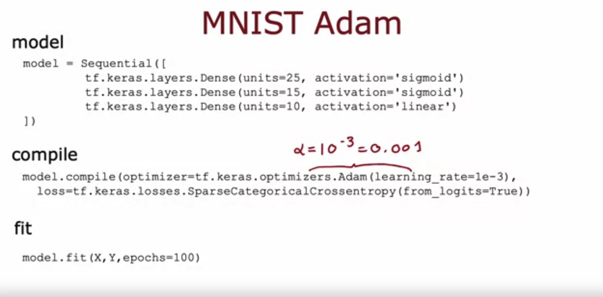
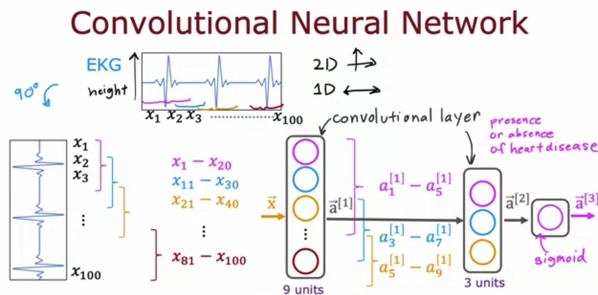

**1.**

**The Adam optimizer is the recommended optimizer for finding the optimal parameters of the model. How do you use the Adam optimizer in TensorFlow?**

- [ ] The call to model.compile() uses the Adam optimizer by default
- [x] When calling model.compile, set optimizer=tf.keras.optimizers.Adam(learning_rate=1e-3).
- [ ] The call to model.compile() will automatically pick the best optimizer, whether it is gradient descent, Adam or something else. So there’s no need to pick an optimizer manually. 
- [ ] The Adam optimizer works only with Softmax outputs. So if a neural network has a Softmax output layer, TensorFlow will automatically pick the Adam optimizer. 

Note: Set the optimizer to Adam.

**2. The lecture covered a different layer type where each single neuron of the layer does not look at all the values of the input vector that is fed into that layer. What is this name of the layer type discussed in lecture?**

- [x] convolutional layer
- [ ] Image layer
- [ ] A fully connected layer
- [ ] 1D layer or 2D layer (depending on the input dimension) 

Note: For a convolutional layer, each neuron takes as input a subset of the vector that is fed into that layer.
