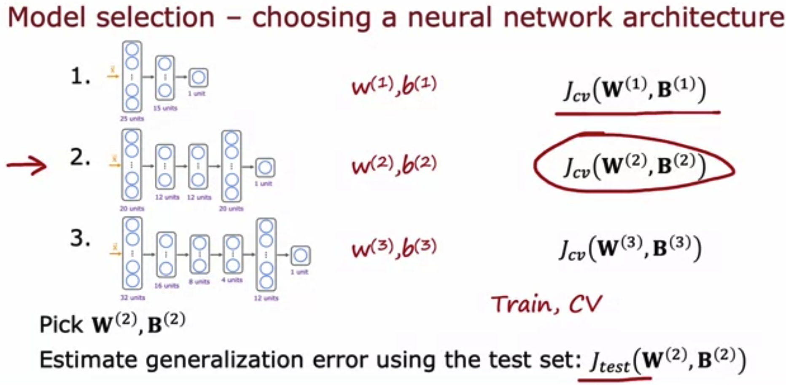

**1. In the context of machine learning, what is a diagnostic?**

- [ ] This refers to the process of measuring how well a learning algorithm does on a test set (data that the algorithm was not trained on). 
- [x] A test that you run to gain insight into what is/isn’t working with a learning algorithm.
- [ ] An application of machine learning to medical applications, with the goal of diagnosing patients’ conditions. 
- [ ] A process by which we quickly try as many different ways to improve an algorithm as possible, so as to see what works.

Note: Yes! A diagnostic is a test that you run to gain insight into what is/isn’t working with a learning algorithm, to gain guidance into improving its performance.

**2. True/False? It is always true that the better an algorithm does on the training set, the better it will do on generalizing to new data.**

- [ ] True 
- [x] False

Note: Actually, if a model overfits the training set, it may not generalize well to new data.

**3. For a classification task; suppose you train three different models using three different neural network architectures. Which data do you use to evaluate the three models in order to choose the best one?**

- [ ] The test set
- [x] The cross validation set 
- [ ] The training set
- [ ] All the data -- training, cross validation and test sets put together. 

Note: Correct. Use the cross validation set to calculate the cross validation error on all three models in order to compare which of the three models is best.
