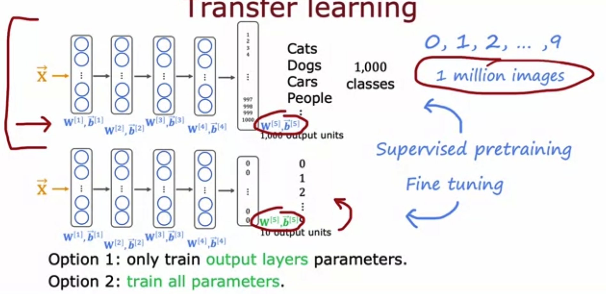

**1. Which of these is a way to do error analysis?**

- [x] Manually examine a sample of the training examples that the model misclassified in order to identify common traits and trends. 
- [ ] Collecting additional training data in order to help the algorithm do better. 
- [ ] Calculating the training error JtrainJtrain​
- [ ] Calculating the test error JtestJtest​

Note: Correct. By identifying similar types of errors, you can collect more data that are similar to these misclassified examples in order to train the model to improve on these types of examples.

**2. We sometimes take an existing training example and modify it (for example, by rotating an image slightly) to create a new example with the same label. What is this process called?**

- [ ] Machine learning diagnostic
- [ ] Error analysis
- [ ] Bias/variance analysis 
- [x] Data augmentation 

Note: Yes! Modifying existing data (such as images, or audio) is called data augmentation.

**3. What are two possible ways to perform transfer learning? Hint: two of the four choices are correct**

- [x] You can choose to train all parameters of the model, including the output layers, as well as the earlier layers.
  - Note: It may help to train all the layers of the model on your own training set. This may take more time compared to if you just trained the parameters of the output layers.
- [ ] Download a pre-trained model and use it for prediction without modifying or re-training it. 
- [ ] Given a dataset, pre-train and then further fine tune a neural network on the same dataset. 
- [x] You can choose to train just the output layers' parameters and leave the other parameters of the model fixed.
  - Note: The earlier layers of the model may be reusable as is, because they are identifying low level features that are relevant to your task.
