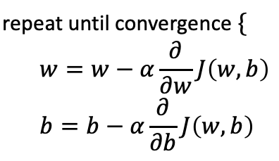

**1. Practice quiz: Train the model with gradient descent**

  - [ ] $w$ decrease
  - [ ] It is not possible to tell if ww will increase or decrease. 
  - [x] $w$ increase
  - [ ] $w$ stays the same
**Note**: The learning rate is always a positive number, so if you take W minus a negative number, you end up with a new value for W that is larger (more positive).

**2. For linear regression, what is the update step for parameter b?**
  - [ ] $b = b - \alpha \frac{1}{m} \sum_{i=1}^m (f_{w,b}(x^{(i)}) - y^{(i)})x^{(i)} $
  - [x] $b = b - \alpha \frac{1}{m} \sum_{i=1}^m (f_{w,b}(x^{(i)}) - y^{(i)})$

Note: The update step is $b = b - \alpha \frac{\partial J(w, b)}{\partial w}$ where $\frac{\partial J(w, b)}{\partial b}$ can be computed with this expression: $\sum^{m}_{i=1}(f_{w,b}(x^{(i)}) - y^{(i)}$
