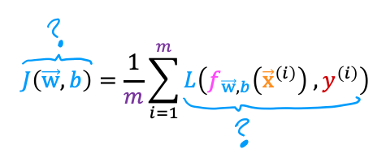

**1.**

**In this lecture series, "cost" and "loss" have distinct meanings. Which one applies to a single training example?**

- [x] Loss
- [ ] Cost 
- [ ] Both Loss and Cost
- [ ] Neither Loss and Cost

Note: In these lectures, loss is calculated on a single training example. It is worth noting that this definition is not universal. Other lecture series may have a different definition.

**1.**

**For the simplified loss function, if the label  $y^{(i)} = 0$ , then what does this expression simplify to?**

- [x] $-\log(1-f_{\vec{w}, b}(x^{(i)}))$
- [ ] $-\log(1-f_{\vec{w}, b}(x^{(i)})) - \log(1-f_{\vec{w}, b}(x^{(i)}))$ 
- [ ] $\log(1-f_{\vec{w}, b}(x^{(i)})) + \log(1-f_{\vec{w}, b}(x^{(i)}))$
- [ ] $\log(f_{\vec{w}, b}(x^{(i)}))$

Note: When $y^{(i)} = 0$ the first term reduces to zero.

