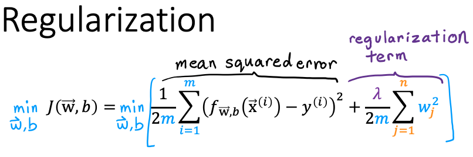

**1. Which of the following can address overfitting?**
- [ ] Remove a random set of training examples
- [x] Select a subset of the more relevant features. *(Note: If the model trains on the more relevant features, and not on the less useful features, it may generalize better to new examples.)*
- [x] Apply regularization *(Note: Regularization is used to reduce overfitting.)*
- [x] Collect more training data *(Note: If the model trains on more data, it may generalize better to new examples)*

**2. You fit logistic regression with polynomial features to a dataset, and your model looks like this.**

**What would you conclude? (Pick one)**

- [ ] The model has high bias (underfit). Thus, adding data is likely to help
- [ ] The model has high variance (overfit). Thus, adding data is, by itself, unlikely to help much. 
- [ ] The model has high bias (underfit). Thus, adding data is, by itself, unlikely to help much. 
- [x] The model has high variance (overfit). Thus, adding data is likely to help

Note: The model has high variance (it overfits the training data). Adding data (more training examples) can help.

**3.**

**Suppose you have a regularized linear regression model.  If you increase the regularization parameter $\lambda$, what do you expect to happen to the parameters $w_1,w_2,...,w_n$?**

- [x] This will reduce the size of the parameters $w_1,w_2,...,w_n$
- [ ] This will increase the size of the parameters $w_1,w_2,...,w_n$​

Note: Regularization reduces overfitting by reducing the size of the parameters $w_1,w_2,...,w_n$​.
